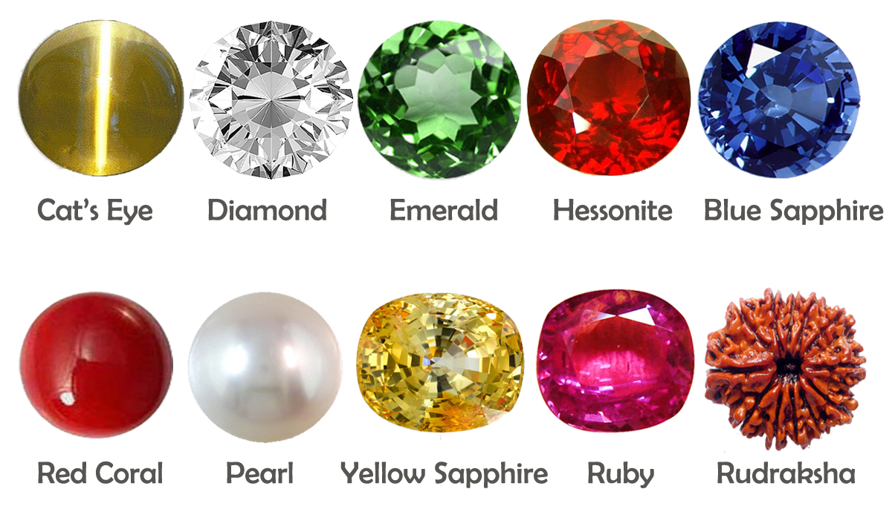
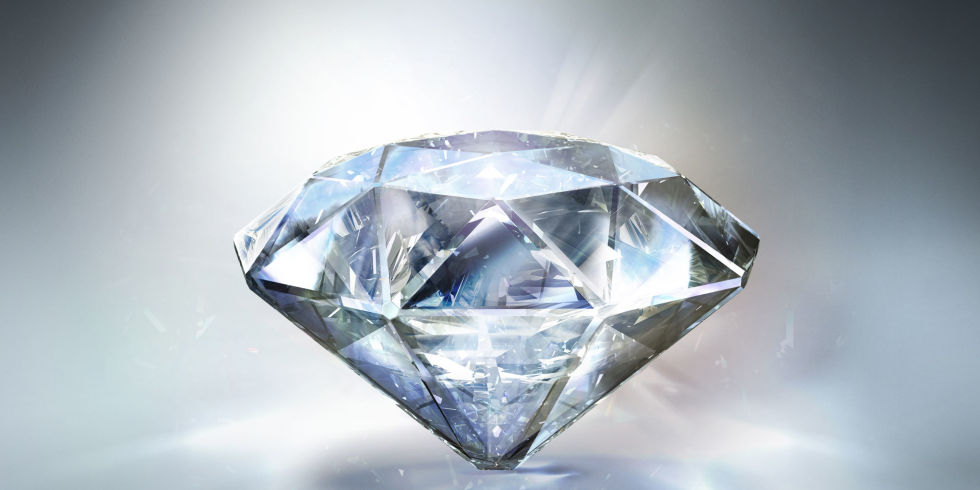
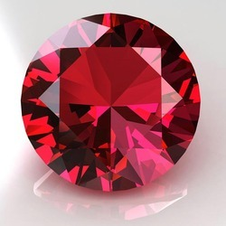
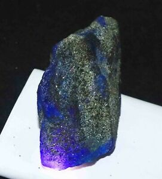

<!DOCTYPE html>
<html lang="en" dir="ltr">
  <head>
    <meta charset="utf-8">
    <title>Precious Gems</title>
  </head>
<body>
<table>
<td></td>
<td><h1>Precious Gems</h1>
 
<em>Summary-</em>

Gems are precious rocks that are found <strong>underground</strong>. Today, I am
going to give you information about <a href="https://en.wikipedia.org/wiki/Diamond">Diamond</a>, <a href="https://en.wikipedia.org/wiki/Sapphire">Sapphire</a>
and <a href="https://en.wikipedia.org/wiki/Ruby">Ruby </a>. If you don't prefer
my information, I have provided links to Wikipedia. So, let's begin.
 </td>
</table>
 

<table>
<td></td>
<td><h3>Diamonds.</h3>

Diamonds are one of the rarest and hardest gemstones in the world. They are used in jewellery
because of their their rarity and brilliance.The modern era of diamond mining began in the 1860s in Kimberley, South Africa with the opening of the first large-scale diamond mine.The first diamond there was found in 1866 on the banks of the Orange River and became known as the Eureka Diamond.
Fleetwood Rawstone's "Red Cap Party" of prospectors on Colesberg Kopje
In 1869, an even larger 83.50-carat diamond was found on the slopes of Colesberg Kopje on the farm Vooruitzigt belonging to the De Beers brothers. This sparked off the famous "New Rush" and within a month, 800 claims were cut into the hillock which were worked frenetically by two to three thousand men. As the land was lowered so the hillock became a mine—in time, the world-renowned Kimberley Mine.Following agreement by the British government on compensation to the Orange Free State for its competing land claims, Griqualand West was annexed to the Cape Colony in 1877.
</td>
</table>

 <table>
<td> </td></img>
<td><h3>Ruby</h3>
  
Rubies are known for their blood red color and beauty.The quality of a ruby is
 determined by its color, cut, and clarity, which, along with carat weight, affect
its value. The brightest and most valuable shade of red called blood-red or pigeon blood,
commands a large premium over other rubies of similar quality. After color follows
clarity: similar to diamonds, a clear stone will command a premium, but a ruby
without any needle-like rutile inclusions may indicate that the stone has been treated.
Ruby is the traditional birthstone for July and is usually pinker than garnet,
although some rhodolite garnets have a similar pinkish hue to most rubies.
The world's most valuable ruby to be sold at auction is the Sunrise Ruby.

</td>
</table>

<table>
<td> 
<td><h3>Sapphire</h3>
  Sapphires come in many colors such as- Blue, Indigo and Pastel.Every sapphire
  mine produces a wide range of quality, and origin is not a guarantee of quality.
   For sapphire, Kashmir receives the highest premium, although Burma, Sri Lanka,
   and Madagascar also produce large quantities of fine quality gems.
The cost of natural sapphires varies depending on their color, clarity, size, cut,
 and overall quality. Sapphires that are completely untreated are worth far more
 than those that have been treated. Geographical origin also has a major impact
 on price. For most gems of one carat or more, an independent report from a respected
  laboratory such as American Gemological Laboratories, Gem Research Swisslab
 GIA, Gübelin, Lotus Gemology, or SSEF, is often required by buyers before
  they will make a purchase.
</td>
</table>

Thank you for choosing my Webpage. I hope you learned something new. Have a good day.
 
If you want to know more about me, <a href="siddewri.github.io/cv/">Click Here</a>
</body>
</html>
